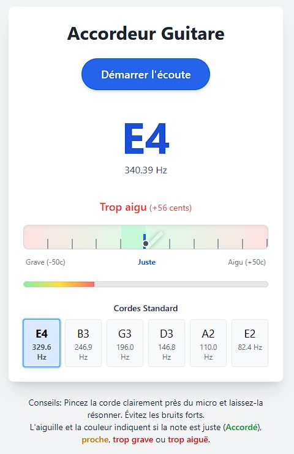

# GuitarTunos - Accordeur de Guitare

Une application web pour accorder votre guitare directement depuis votre navigateur. Cette application utilise l'API audio Web pour détecter les fréquences jouées et vous aider à accorder chaque corde avec précision.



## Fonctionnalités

- Détection en temps réel de la hauteur des notes jouées
- Affichage de la note détectée et de sa fréquence
- Indication visuelle si la note est juste, trop grave ou trop aiguë
- Affichage de l'écart en cents (1/100e de demi-ton)
- Indicateur de volume sonore
- Interface utilisateur intuitive avec aiguille d'accordage
- Référence des fréquences standards pour les six cordes de guitare
- **Nouveau** : Génération des notes de référence pour chaque corde avec un simple clic

## Prérequis techniques

- Node.js (version 18 ou supérieure)
- npm ou yarn

## Installation

1. Clonez ce dépôt :
   ```bash
   git clone https://github.com/artkabis/guitarTuner.git
   cd guitarTuner
   ```

2. Installez les dépendances :
   ```bash
   npm install
   # ou
   yarn
   ```

3. Lancez le serveur de développement :
   ```bash
   npm run dev
   # ou
   yarn dev
   ```

4. Ouvrez votre navigateur à l'adresse indiquée (généralement http://localhost:5173)

## Utilisation

1. Autorisez l'accès au microphone lorsque le navigateur vous le demande
2. Cliquez sur "Démarrer l'écoute"
3. Jouez une corde de votre guitare
4. Observez la note détectée et l'aiguille de l'accordeur
5. Ajustez la tension de la corde jusqu'à ce que l'aiguille soit centrée et que l'indicateur affiche "Accordé!"
6. Répétez pour les autres cordes

### Utilisation de la génération des notes de référence

1. Dans la section "Cordes Standard" au bas de l'interface, cliquez sur n'importe quelle note (E2, A2, D3, G3, B3 ou E4)
2. Un son de référence correspondant exactement à la fréquence de cette corde sera joué
3. Ajustez votre corde de guitare jusqu'à ce que sa sonorité corresponde au son de référence
4. Pour arrêter la lecture du son, cliquez à nouveau sur la même note ou utilisez le bouton "Arrêter le son"
5. Cette fonctionnalité est particulièrement utile pour :
   - Les environnements bruyants où la détection par microphone est difficile
   - L'accordage à l'oreille pour les musiciens plus expérimentés
   - La comparaison directe entre votre corde et la note de référence parfaite

## Technologies utilisées

- [React](https://reactjs.org/) - Framework JavaScript pour l'interface utilisateur
- [TypeScript](https://www.typescriptlang.org/) - Superset typé de JavaScript
- [Tailwind CSS](https://tailwindcss.com/) - Framework CSS utilitaire
- [Tone.js](https://tonejs.github.io/) - Bibliothèque pour manipuler l'audio dans le navigateur
- [Vite](https://vitejs.dev/) - Outil de build et serveur de développement

## Structure du projet

```
/src
  /components
    GuitarTuner.tsx    # Composant principal de l'accordeur
  App.tsx              # Composant racine de l'application
  main.tsx             # Point d'entrée de l'application
  index.css            # Styles CSS incluant Tailwind
/public
  ...                  # Ressources statiques
```

## Comment ça marche

### Détection des notes
L'application utilise l'API Web Audio via Tone.js pour accéder au microphone, analyser le signal audio entrant et déterminer la fréquence fondamentale à l'aide d'une transformation de Fourier rapide (FFT). La fréquence détectée est ensuite comparée aux fréquences standard des cordes de guitare pour déterminer la note la plus proche et calculer l'écart en cents.

### Génération des sons de référence
L'application utilise le synthétiseur intégré de Tone.js (Tone.Synth) pour générer des ondes sonores précises correspondant exactement aux fréquences des cordes de guitare standard. Un oscillateur de type "triangle" est utilisé pour produire un son plus doux et naturel qui se rapproche de celui d'une corde de guitare. Les paramètres d'enveloppe ADSR (Attack, Decay, Sustain, Release) sont optimisés pour simuler la résonance d'une corde de guitare.

### Fréquences standards des cordes (accordage standard E)

- Mi grave (E2): 82.41 Hz
- La (A2): 110.00 Hz
- Ré (D3): 146.83 Hz
- Sol (G3): 196.00 Hz
- Si (B3): 246.94 Hz
- Mi aigu (E4): 329.63 Hz

## Dépannage

### L'application ne détecte pas mon microphone
- Assurez-vous que votre navigateur a l'autorisation d'accéder au microphone
- Vérifiez que votre microphone fonctionne avec d'autres applications
- Essayez un navigateur récent comme Chrome, Firefox ou Edge

### La détection des notes n'est pas précise
- Jouez les cordes une par une, dans un environnement calme
- Approchez le microphone de la guitare
- Assurez-vous que le volume détecté est suffisant (visible sur l'indicateur)

### Les sons de référence ne sont pas joués
- Assurez-vous que le son de votre navigateur est activé et que le volume est suffisant
- Le premier clic peut prendre un court instant pour initialiser l'API Web Audio
- Vérifiez que vous n'avez pas de bloqueurs de sons automatiques dans votre navigateur
- Si vous utilisez Safari, assurez-vous que les autorisations pour l'audio sont activées

### Les styles ne s'affichent pas correctement
- Assurez-vous que Tailwind CSS est correctement configuré
- Vérifiez que le fichier index.css est bien importé dans main.tsx
- Consultez la console du navigateur pour détecter d'éventuelles erreurs

## Licence

Ce projet est sous licence MIT - voir le fichier LICENSE pour plus de détails.

## Contribuer

Les contributions sont les bienvenues ! N'hésitez pas à ouvrir une issue ou à proposer une pull request.

1. Forkez le projet
2. Créez une branche pour votre fonctionnalité (`git checkout -b feature/amazing-feature`)
3. Committez vos changements (`git commit -m 'Add some amazing feature'`)
4. Poussez vers la branche (`git push origin feature/amazing-feature`)
5. Ouvrez une Pull Request

## Crédits

Développé par [Artkabis] - [artkabis.fr](https://artkabis.fr)